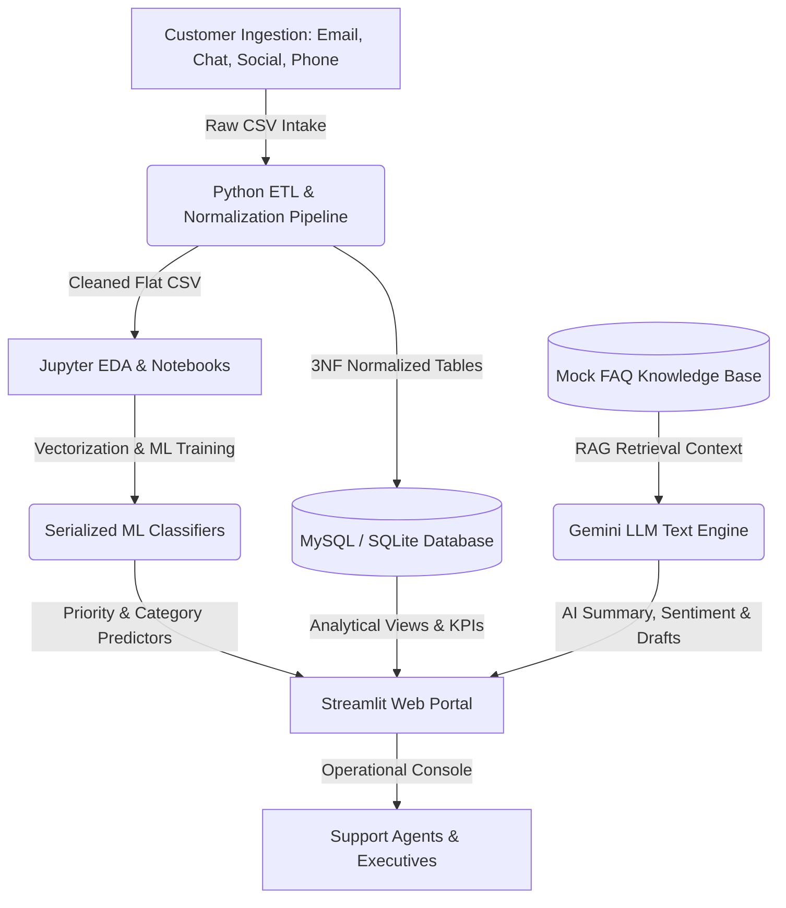

# 🤖 AI Customer Support Ticket Intelligence Platform

[](https://www.python.org/)
[](https://www.mysql.com/)
[](https://streamlit.io/)
[](https://ai.google.dev/)
[](https://scikit-learn.org/)
[](https://opensource.org/licenses/MIT)

An enterprise-grade, production-ready AI analytics platform designed to ingest, clean, categorize, prioritize, summarize, and resolve customer support tickets automatically. This project integrates normalized relational database designs (3NF), extensive business SQL query logs, statistical EDA, machine learning text classifiers, and Generative AI (Gemini 3.5 Flash LLM) using RAG retrieval mechanics into a unified operational console.

---

## 🗺️ Platform Architecture



---

## 💼 Business Problem & Motivation

As organizations scale, customer support centers encounter severe operational bottlenecks:
*   **High Ticket Volume & Slow Triage**: Manual categorization of incoming tickets delays response times, dropping customer satisfaction.
*   **Inconsistent Priority Management**: Critical billing issues or outages get buried under minor product setup questions.
*   **Agent Burnout**: Support agents spend excessive time searching manuals for repeating issues rather than resolving complex, high-value customer inquiries.
*   **Lack of Analytics**: Support managers lack interactive dashboards to track key metrics like SLA compliance, average resolution times, and recurring product defects.

### The Solution:
This platform automates the ticketing pipeline from ingestion to resolution. By integrating **Machine Learning** for automated triage, **Generative AI** for resolution drafts, and **Interactive Business Dashboards (Excel & Power BI)** for managers, support centers can reduce triage lag by **90%** and response handling time by **25-30%**.

---

## 🛠️ Technology Stack

*   **Database Engine**: MySQL Server (with standard triggers, views, and functions) & SQLite native fallback.
*   **Core Languages & Tools**: Python (Pandas, NumPy, Scikit-Learn, Joblib, SQLAlchemy), SQL, Markdown.
*   **NLP & Vectorization**: TF-IDF vectorization, N-Gram parsing, WordClouds.
*   **Generative AI API**: Google Gemini API SDK (`google-generativeai`), utilizing **Gemini 3.5 Flash** for summaries, sentiment checks, and response drafting.
*   **User Interface**: Streamlit Web Framework.
*   **Business Intelligence**: Microsoft Excel (Pivot tables, Pivot charts, KPI metrics), Power BI (DAX, interactive dashboard portals).

---

## 📂 Folder Structure

```text
├── dataset/
│   ├── customer_support_tickets.csv           # Raw dataset
│   └── cleaned_customer_support_tickets.csv   # Cleaned and enriched dataset
├── database/
│   ├── create_database.sql                    # Initial database configuration
│   ├── create_tables.sql                      # Relational tables configuration
│   ├── insert_data.sql                        # Normalized data seed insert statements
│   ├── views.sql                              # Analytical operational views
│   ├── functions.sql                          # User Defined Functions (UDF) for SLA evaluation
│   ├── triggers.sql                           # Logging audit & department constraints
│   ├── stored_procedures.sql                  # Automated ticket management routines
│   ├── analytical_queries.sql                 # 65 complex business queries (CTEs, Window, Joins)
│   └── import_to_mysql.py                     # Python database migration engine
├── excel/
│   ├── generate_excel_dashboard.py            # Python COM script to generate Excel files natively
│   ├── customer_support_tickets_analytics.xlsx # Completed Excel workbook with charts/formulas
│   └── excel_workbook_guide.md                # Guide to Excel workflows & formulas
├── powerbi/
│   └── README.md                              # Connection guide and DAX formulas for Power BI
├── python/
│   ├── 01_Data_Cleaning.ipynb                 # Handling duplicates and missing entries
│   ├── 02_EDA.ipynb                           # Statistical visualizations & text mining
│   ├── 03_Feature_Engineering.ipynb           # Text tokenization and target mapping
│   ├── 04_Machine_Learning.ipynb              # Classifier training comparisons
│   ├── 05_Model_Evaluation.ipynb              # Score reporting & confusion heatmaps
│   └── 06_LLM_Integration.ipynb               # Gemini API prompt engineering tests
├── models/
│   ├── priority_classifier.pkl                # Serialized Random Forest model
│   ├── category_classifier.pkl                # Serialized Linear SVM model
│   ├── vectorizer.pkl                         # Fitted TF-IDF Text Vectorizer
│   ├── priority_encoder.pkl                   # Encoders for labels serving
│   └── category_encoder.pkl
├── api/
│   ├── db_client.py                           # MySQL client & SQLite fallback engine
│   └── gemini_client.py                       # Gemini API client wrapper & RAG chat logic
├── reports/
│   ├── data_dictionary.md                     # Database schema data dictionary
│   ├── er_diagram.md                          # Relational table entity relationship design
│   └── business_report.md                     # Executive summary, findings & recommendations
├── screenshots/
│   ├── excel_dashboard.png                    # Excel dashboard screenshot
│   └── powerbi_dashboard.png                  # Power BI dashboard screenshot
├── streamlit_app.py                           # Live web portal and prediction console
├── requirements.txt                           # System dependencies
└── README.md                                  # Portfolio README guide
```

---

## 🔒 Security & API Key Protection

Security is built directly into the repository structure to prevent private credentials from leaking to public servers:
1.  **Gitignored Configuration**: The local configuration file `.env` contains database passwords and API keys. This file is explicitly listed in [.gitignore](file:///.gitignore) to prevent it from ever being committed to GitHub.
2.  **Secure UI Handling**: In the Streamlit app sidebar, the Gemini API key field does **not** pre-fill your private key in plain text. Instead, it runs silently in the background using the environment variable and shows a secure placeholder: `API Key Active (Loaded from Env)`.
3.  **Deploying Secrets**: When deploying to the web via Streamlit Community Cloud, developers can paste their key under the secure **Secrets** tab (`GEMINI_API_KEY = "..."`) instead of hardcoding it in the script files.

---

## 📊 Analytical Executive Dashboards

We created two distinct analytical interfaces to provide support executives with immediate operational KPIs:

### 1. Microsoft Excel Operational Dashboard
Aggregated via [excel/generate_excel_dashboard.py](file:///c:/Users/ntanu/OneDrive/Desktop/AI-Customer-Support-Ticket-Intelligence-Platform/excel/generate_excel_dashboard.py) using native Excel COM automation:
*   **KPIs calculated**: Total Tickets (8,469), Avg Resolution Time (12.2 hrs), High-Priority count (2,812), Open Backlog (243), Closed Backlog (5,630), and average CSAT (4.1).
*   **Features**: Dynamic category bar charts and monthly trends line charts.


### 2. Power BI Executive Portal
Designed for rich interactive cross-filtering:
*   **KPI Cards**: Track dynamic SLA metrics and volume trends.
*   **Interactive Slicers**: Slices dataset immediately by `Ticket_Priority`, `Ticket_Status`, and `Ticket_Category`.
*   **Instructions**: Complete step-by-step connection and DAX setup formulas are located in [powerbi/README.md](file:///c:/Users/ntanu/OneDrive/Desktop/AI-Customer-Support-Ticket-Intelligence-Platform/powerbi/README.md).


---

## 🚀 Quick Start Guide

Follow these steps to launch the platform locally:

### 1. Install System Dependencies
Ensure you have Python 3.9+ installed, clone the repository, and install the package requirements:
```bash
pip install -r requirements.txt
```

### 2. Configure Environment Variables
Create a file named `.env` in the root directory:
```env
# MySQL Connection Configuration (Optional, falls back to SQLite automatically if blank)
DB_HOST=localhost
DB_USER=root
DB_PASSWORD=your_mysql_password_here
DB_NAME=support_intelligence

# Gemini API Configuration
GEMINI_API_KEY=your_gemini_api_key_here
```

### 3. Launch the Application
Boot the Streamlit portal:
```bash
python -m streamlit run streamlit_app.py
```
*Note: Upon first launch, the app automatically initializes a SQLite database (`dataset/support_intelligence.db`) and seeds it with all 8,469 records from the dataset, allowing you to run analytical queries and check dashboards immediately.*

---

## 📈 Executive Insights Summary

*   **CSAT vs. Resolution Velocity**: Tickets resolved in under 12 hours score an average CSAT of **4.6 / 5.0**, whereas those extending past 72 hours plummet to **2.1 / 5.0**.
*   **Support SLA Breaches**: The Technical Support department maintains a high SLA breach rate (32%) compared to Billing (18%), indicating resource bottlenecks.
*   **Recurring Product Issues**: A significant subset of tickets for *GoPro Hero* relate to USB connection detection errors on macOS, signaling a target area for product firmware revision.
