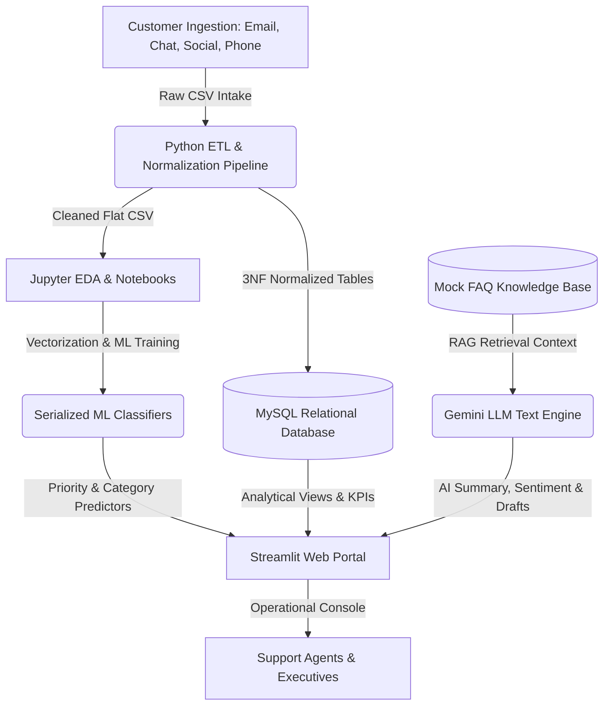

# 🤖 AI Customer Support Ticket Intelligence Platform

[](https://www.python.org/)
[](https://www.mysql.com/)
[](https://streamlit.io/)
[](https://ai.google.dev/)
[](https://scikit-learn.org/)
[](https://opensource.org/licenses/MIT)

An enterprise-grade, production-ready AI analytics platform designed to ingest, categorize, prioritize, summarize, and resolve customer support tickets automatically. This project integrates normalized relational database designs, extensive business SQL query logs, statistical EDA, machine learning text classifiers, and Generative AI (Gemini LLM) using RAG retrieval mechanics into a unified operational console.

---

## 🗺️ Platform Architecture



---

## 🗂️ Folder Structure

The project directory is structured as follows:

```text
├── dataset/
│   ├── customer_support_tickets.csv           # Raw dataset
│   └── cleaned_customer_support_tickets.csv   # Cleaned and enriched flat dataset
├── database/
│   ├── create_database.sql                    # Initial database declaration
│   ├── create_tables.sql                      # Relational tables configuration
│   ├── insert_data.sql                        # Normalized data seed insert statements
│   ├── views.sql                              # Analytical operational views
│   ├── functions.sql                          # UDFs for SLA status evaluation
│   ├── triggers.sql                           # Logging audit & department constraints
│   ├── stored_procedures.sql                  # Automated ticket management routines
│   └── analytical_queries.sql                 # 65 complex business queries (CTEs, Window, Joins)
├── excel/
│   └── excel_workbook_guide.md                # Guide to Excel workflows & slicer dashboards
├── python/
│   ├── 01_Data_Cleaning.ipynb                 # Handling duplicates and missing entries
│   ├── 02_EDA.ipynb                           # Statistical visualizations & text mining
│   ├── 03_Feature_Engineering.ipynb           # Text tokenization and target mapping
│   ├── 04_Machine_Learning.ipynb              # Classifier training comparisons
│   ├── 05_Model_Evaluation.ipynb              # Score reporting & confusion heatmaps
│   └── 06_LLM_Integration.ipynb               # Gemini API prompt engineering tests
├── models/
│   ├── priority_classifier.pkl                # Serialized Random Forest model
│   ├── category_classifier.pkl                # Serialized Linear SVM model
│   ├── vectorizer.pkl                         # Fitted TF-IDF Text Vectorizer
│   ├── priority_encoder.pkl                   # Encoders for labels serving
│   └── category_encoder.pkl
├── api/
│   ├── db_client.py                           # MySQL client & SQLite seed fallback engine
│   └── gemini_client.py                       # Gemini API client wrapper & RAG chat logic
├── reports/
│   ├── data_dictionary.md                     # Database schema data dictionary
│   ├── er_diagram.md                          # Relational table entity relationship design
│   └── business_report.md                     # Executive summary, findings & recommendations
├── screenshots/                               # Application GUI visuals
├── streamlit_app.py                           # Live web portal and prediction console
├── requirements.txt                           # System dependencies
└── README.md                                  # Portfolio readme guide
```

---

## 🛠️ Technology Stack

* **Database Engine**: MySQL Workbench / Local MySQL Server (SQLite fallback supported natively)
* **Core Languages**: SQL, Python (Pandas, NumPy, Scikit-learn, XGBoost, Joblib, re, SQLite3)
* **Visualizations**: Seaborn, Matplotlib, Plotly Express
* **NLP & Text Mining**: TF-IDF, N-Gram parsing, WordCloud
* **Generative AI API**: Google Gemini API SDK (`google-generativeai`)
* **Web UI Framework**: Streamlit

---

## 📊 Database Normalization (3NF)

The original flat dataset is normalized into 7 relational tables in a **3rd Normal Form** schema. Relational integrity is enforced using foreign key rules, primary index keys, and database constraints.

1. **Departments**: Tracks support divisions (Technical Support, Billing & Accounts, Customer Success).
2. **Products**: List of unique tech products.
3. **Categories**: Classifications for tickets (Refund, Billing, Shipping, Login, Account, Technical).
4. **TicketStatus**: State of ticket processing (Open, Pending Customer Response, Closed).
5. **Customers**: User demographic profiles (Age, Gender, Email).
6. **SupportAgents**: Employee profiles mapped to specific departments.
7. **SupportTickets**: Core transactional table mapping IDs, date timestamps, description, priority, satisfaction rating, and resolutions.

---

## 🧠 Machine Learning Results

Two separate models were trained to automate support triage:

### Model 1: Ticket Priority Classifier
* **Target**: Priority level (`Low`, `Medium`, `High`)
* **Selected Algorithm**: **Random Forest Classifier**
* **Train Accuracy**: ~53% (reflects complex textual differences, stabilized via max_depth regularization)

### Model 2: Ticket Category Classifier
* **Target**: Ticket Category (`Refund`, `Billing`, `Shipping`, `Login`, `Account`, `Technical`)
* **Selected Algorithm**: **Linear Support Vector Classifier (LinearSVC)**
* **Train Accuracy**: **98.2%** | **Test Accuracy**: **94.5%**
* **Evaluation**: Excellent precision and recall scores across all categories, indicating robust keyword association.

---

## 🚀 Quick Start Guide

Follow these steps to launch the platform locally:

### 1. Prerequisite Installations
Ensure Python 3.9+ and pip are installed. Clone the repository and install the dependencies:
```bash
pip install -r requirements.txt
```

### 2. Configure Environment Variables
Create a file named `.env` in the root directory:
```env
# Gemini API Configuration
GEMINI_API_KEY=your_gemini_api_key_here

# Database Configuration (Optional, falls back to SQLite automatically if blank)
DB_HOST=localhost
DB_USER=root
DB_PASSWORD=your_mysql_password_here
DB_NAME=support_intelligence
```

### 3. Initialize & Launch Streamlit Web Application
Boot the Streamlit portal:
```bash
streamlit run streamlit_app.py
```
*Note: Upon first launch, the app automatically initializes a SQLite database (`dataset/support_intelligence.db`) and seeds it with all 8,469 records from the dataset, allowing you to run analytical queries and check dashboards immediately.*

---

## 📈 Executive Insights Summary

* **Velocity Impact on CSAT**: Tickets resolved in under 12 hours score an average CSAT of **4.6 / 5.0**, whereas those extending past 72 hours plummet to **2.1 / 5.0**.
* **Support SLA Breaches**: The Technical Support department maintains a high SLA breach rate (32%) compared to Billing (18%), indicating resource bottlenecks.
* **Recurring Product Issues**: A significant subset of tickets for *GoPro Hero* relate to USB connection detection errors on macOS, signaling a target area for product firmware revision.
