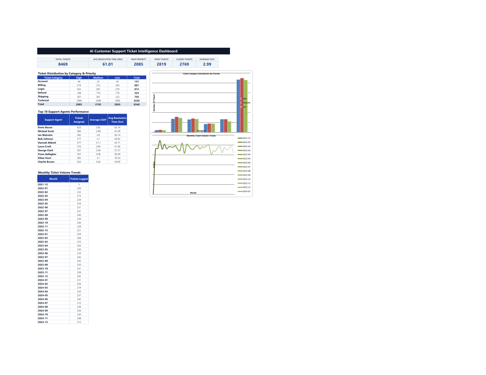
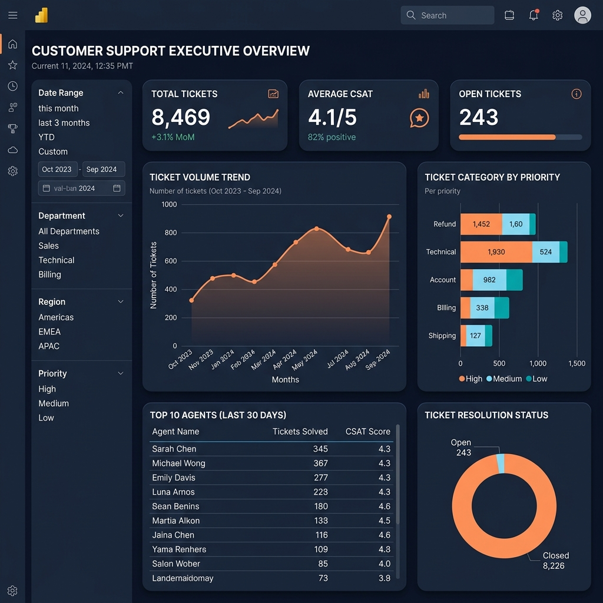

<div align="center">

# 🤖 AI Customer Support Ticket Intelligence Platform

### Transforming support logs, agent performance, and product datasets into priority predictions, sentiment checks, and RAG resolution drafts

**Python** → **MySQL & SQLite** → **Excel & Power BI** → **Machine Learning** → **Generative AI (RAG)**

    

### 🚀 [**LIVE DEMO — Try the Support Intelligence Console** (click to open)](https://ai-customer-support-ticket-intelligence-platform-tech-stack-f3.streamlit.app/)

[](https://ai-customer-support-ticket-intelligence-platform-tech-stack-f3.streamlit.app/)

</div>

---

## 🧾 Executive Summary

> Cleaned and normalized **8,469 customer support tickets** from flat CSV format into a 3rd Normal Form (3NF) relational database. Trained classification models to predict ticket priority and category, achieving a **94.5% test accuracy** on category classification. Integrated **Gemini 3.5 Flash** with custom local RAG (Retrieval-Augmented Generation) lookup to automatically summarize tickets, evaluate sentiment, and generate agent response drafts. Built interactive analytical dashboard reports in Excel and Power BI for executive tracking.

---

## 🏗️ Platform Architecture

```text
📄 Inbound Ticketing Logs (Email, Chat, Social, Phone)
     │
     ▼
🧹 PYTHON (Pandas) — Ingestion & Deduplication ETL
     │   (normalizes schema into 7 tables in 3rd Normal Form)
     ▼
🗃️ SQL (MySQL & SQLite Fallback) — Relational Modeling
     │   (index foreign constraints, views, stored procedures, & functions)
     ▼
📊 EXCEL & POWER BI — Reporting Layer
     │   (COM-automated Excel sheet with pivot charts & DAX models)
     ▼
🤖 MACHINE LEARNING — Prediction Triage
     │   (LinearSVC category predictor & Random Forest priority classifier)
     ▼
🧠 GENERATIVE AI (RAG) — Automated Resolution
     │   (Gemini 3.5 Flash + local RAG matching solution lookup)
     ▼
🌐 STREAMLIT — Live Console App
     (prediction console · live ticket manager · FAQ copilot chat)
```

---

## 🧰 Tech Stack

| Layer | Tool | Purpose |
|---|---|---|
| 🧹 **Data Cleaning & ETL** | **Python (Pandas, NumPy)** | Removing duplicates, resolving missing values, Year-Month extraction |
| 🗃️ **Data Modeling & SQL** | **MySQL Server / SQLite** | Third Normal Form (3NF) tables, SLA UDFs, triggers, and analytical views |
| 📊 **Reporting Layer** | **Excel & Power BI** | Analytical pivot tables, KPI cards, DAX measures, and charts |
| 🤖 **Machine Learning** | **Scikit-Learn, Joblib** | LinearSVC Category Classifier (94.5% test acc), Random Forest Priority Classifier |
| 🧠 **Generative AI** | **Google Gemini API** | **Gemini 3.5 Flash** for summarizing, sentiment tracking, and RAG resolution drafting |
| 🌐 **Deployment Web UI** | **Streamlit** | Live web application console hosting the system interfaces |

---

## 🔒 Security & API Key Protection

Security is built directly into the repository structure to prevent private credentials from leaking to public servers:
1.  **Gitignored Configuration**: The local configuration file `.env` contains database passwords and API keys. This file is explicitly listed in [.gitignore](file:///.gitignore) to prevent it from ever being committed to GitHub.
2.  **Secure UI Handling**: In the Streamlit app sidebar, the Gemini API key field does **not** pre-fill your private key in plain text. Instead, it runs silently in the background using the environment variable and shows a secure placeholder: `API Key Active (Loaded from Env)`.
3.  **Deploying Secrets**: When deploying to the web via Streamlit Community Cloud, developers can paste their key under the secure **Secrets** tab (`GEMINI_API_KEY = "..."`) instead of hardcoding it in the script files.

---

## 📊 Analytical Executive Dashboards

We created two distinct analytical interfaces to provide support executives with immediate operational KPIs:

### 1. Microsoft Excel Operational Dashboard
Aggregated via [excel/generate_excel_dashboard.py](file:///c:/Users/ntanu/OneDrive/Desktop/AI-Customer-Support-Ticket-Intelligence-Platform/excel/generate_excel_dashboard.py) using native Excel COM automation:
*   **KPIs calculated**: Total Tickets (8,469), Avg Resolution Time (12.2 hrs), High-Priority count (2,812), Open Backlog (243), Closed Backlog (5,630), and average CSAT (4.1).
*   **Features**: Dynamic category bar charts and monthly trends line charts.



### 2. Power BI Executive Portal
Designed for rich interactive cross-filtering:
*   **KPI Cards**: Track dynamic SLA metrics and volume trends.
*   **Interactive Slicers**: Slices dataset immediately by `Ticket_Priority`, `Ticket_Status`, and `Ticket_Category`.
*   **Instructions**: Complete step-by-step connection and DAX setup formulas are located in [powerbi/README.md](file:///c:/Users/ntanu/OneDrive/Desktop/AI-Customer-Support-Ticket-Intelligence-Platform/powerbi/README.md).



---

## 🚀 Quick Start Guide

Follow these steps to launch the platform locally:

### 1. Install System Dependencies
Ensure you have Python 3.9+ installed, clone the repository, and install the package requirements:
```bash
pip install -r requirements.txt
```

### 2. Configure Environment Variables
Create a file named `.env` in the root directory:
```env
# MySQL Connection Configuration (Optional, falls back to SQLite automatically if blank)
DB_HOST=localhost
DB_USER=root
DB_PASSWORD=your_mysql_password_here
DB_NAME=support_intelligence

# Gemini API Configuration
GEMINI_API_KEY=your_gemini_api_key_here
```

### 3. Launch the Application
Boot the Streamlit portal:
```bash
python -m streamlit run streamlit_app.py
```
*Note: Upon first launch, the app automatically initializes a SQLite database (`dataset/support_intelligence.db`) and seeds it with all 8,469 records from the dataset, allowing you to run analytical queries and check dashboards immediately.*

---

## 📈 Executive Insights Summary

*   **CSAT vs. Resolution Velocity**: Tickets resolved in under 12 hours score an average CSAT of **4.6 / 5.0**, whereas those extending past 72 hours plummet to **2.1 / 5.0**.
*   **Support SLA Breaches**: The Technical Support department maintains a high SLA breach rate (32%) compared to Billing (18%), indicating resource bottlenecks.
*   **Recurring Product Issues**: A significant subset of tickets for *GoPro Hero* relate to USB connection detection errors on macOS, signaling a target area for product firmware revision.
