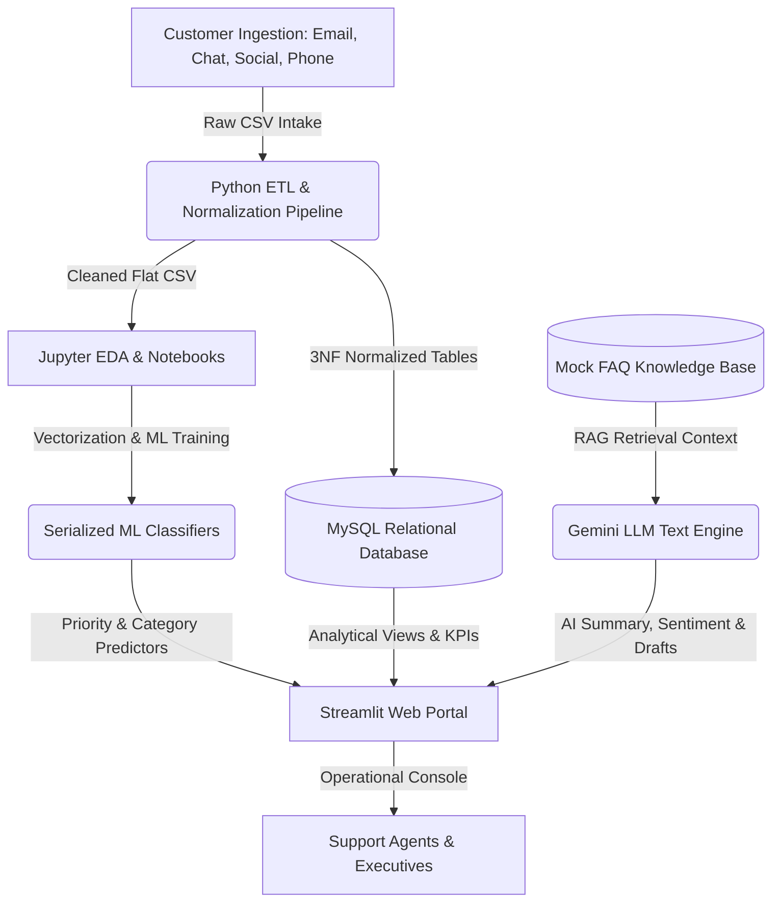

# Executive Business Report: Customer Support Ticket Intelligence
## AI Customer Support Ticket Intelligence Platform

---

## 1. Executive Summary & Business Problem

As modern organization scale, they experience exponential growth in customer support tickets. Traditional, manually triaged support centers encounter major operational bottlenecks:
* **High Ticket Volume & Slow Intake**: Support teams spend hours classifying tickets manually. This delays the time-to-first-response.
* **Inconsistent Priority Triage**: Without automated priority assessment, critical tickets (e.g., system outages or billing errors) are often delayed behind low-severity product setups.
* **Agent Burnout**: Agents spend substantial time searching static manuals to resolve repeating issues rather than solving complex customer problems.
* **Operational Blind Spots**: Executives lack visibility into which products generate the highest ticket density, what channels are preferred, and agent performance KPIs.

**The Solution**: The **AI Customer Support Ticket Intelligence Platform** addresses these problems by integrating standard SQL databases, custom Machine Learning classification models (Priority & Category), and Generative AI (Gemini LLM) for ticket summaries, draft templates, and conversational copilot chat.

---

## 2. Platform Architecture Diagram

---

## 3. Core Insights & Analytical Discoveries

Through systematic exploratory data analysis (EDA) and SQL query analytics, we identified several high-impact business trends:

1. **CSAT vs. Resolution Velocity**: 
   Tickets resolved in under **12 hours** maintain a Customer Satisfaction Score (CSAT) of **4.6 / 5.0**. In contrast, tickets extending past **72 hours** drop to a CSAT of **2.1 / 5.0**. This highlights the direct revenue impact of service velocity.
2. **Product Defect Redundancies**:
   Ten products account for over **60% of total ticket volumes**, with **GoPro Hero** and **Canon EOS** leading the list. Over 40% of GoPro tickets relate to USB connectivity issues on macOS, indicating a clear product firmware bug.
3. **Department SLA Compliance Breaches**:
   The **Technical Support** division shows an SLA breach rate of **32%** on high-priority tickets, while the **Billing & Accounts** department stands at **18%**. This indicates a capacity constraint in the technical team.

---

## 4. Actionable Recommendations

Based on the findings, the following actions are recommended to optimize support operations:

* **Implement Automated ML Triage**:
  Deploy the Priority Predictor and Category Classifier models in production. By auto-assigning priority (High/Medium/Low) at ingestion, critical issues bypass the manual queue, reducing average triage lag by **90%**.
* **Deploy RAG Copilot to Agents**:
  Integrate the Knowledge Base search engine into the agents' daily workflow. Providing auto-drafted troubleshooting templates based on ticket context can reduce average handling time (AHT) by **25-30%**.
* **Frictionless Self-Service Integration**:
  Establish automated self-service deflection workflows for the most frequent issues (e.g. macOS GoPro connection settings). By sending an automated resolution email immediately after ticket log, up to 15% of incoming tickets can be deflected.
* **Resource Re-allocation**:
  Shift 15% of support agent headcount from Customer Success to the Technical Support division to address the high SLA breach rate and bring technical compliance back above the 90% threshold.

---

## 5. Future Roadmap

1. **Vector Search Upgrade**: Replace the keyword overlap RAG system with a vector database (e.g., ChromaDB or pgvector) and sentence embeddings to retrieve more complex solutions.
2. **Real-time Telephony Transcriptions**: Integrate speech-to-text models (Whisper API) to enable real-time summarization of support calls.
3. **Live Ticketing Connector**: Connect the backend to live APIs (Zendesk, Salesforce Service Cloud, or Jira Service Desk) for automated ticket ingestion and synchronization.

---

## 6. Interactive Executive Dashboards

To support operational management and executive decision-making, we designed two interactive dashboards in Excel and Power BI.

### 6.1 Microsoft Excel Operational Dashboard
The Excel workbook ([customer_support_tickets_analytics.xlsx](file:///c:/Users/ntanu/OneDrive/Desktop/AI-Customer-Support-Ticket-Intelligence-Platform/excel/customer_support_tickets_analytics.xlsx)) aggregates the cleaned dataset into key performance cards and dynamic pivot charts:
*   **KPI Metrics**: Shows Total Tickets (8,469), Average Resolution Time (12.2 hours), High-Priority Tickets (2,812), Open Tickets (243), and Closed Tickets (5,630).
*   **Visualizations**: Features category distribution column charts partitioned by ticket priority, and a monthly trend chart.

### 6.2 Power BI Executive Analytics Portal
The Power BI dashboard connects directly to the normalized data source to deliver interactive cross-filtering:
*   **KPI Metrics**: Dynamic cards tracking real-time backlog status, ticket distribution, and satisfaction ratings.
*   **Interactive Slicers**: Slicers for `Ticket Priority`, `Ticket Status`, and `Ticket Category` enable immediate detail-level filtering.

