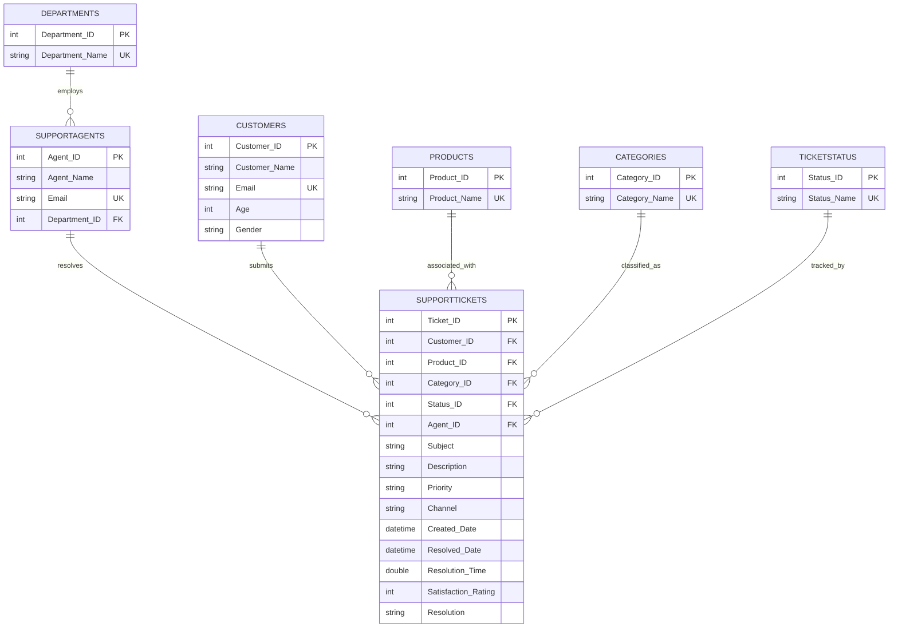

# Database Entity-Relationship (ER) Diagram Description
## AI Customer Support Ticket Intelligence Platform

The database model is designed using standard 3rd Normal Form (3NF) relational practices, separating core entities (Customers, SupportAgents, Products, Categories, TicketStatus, and Departments) from transactional tickets to eliminate data redundancies.

---

### Entity-Relationship Diagram (Mermaid Rendering)

---

### Relationship Rules

1. **Departments to SupportAgents (1:N)**:
   * A support department employs many support agents.
   * An agent belongs to exactly one department (or NULL if unassigned).
2. **SupportAgents to SupportTickets (1:N)**:
   * A support agent can be assigned to resolve multiple support tickets.
   * A ticket has at most one active support agent assigned.
3. **Customers to SupportTickets (1:N)**:
   * A customer can log/submit multiple support tickets over time.
   * A support ticket belongs to exactly one customer.
4. **Products to SupportTickets (1:N)**:
   * A tech product can have multiple related support tickets.
   * A ticket belongs to exactly one product.
5. **Categories to SupportTickets (1:N)**:
   * A ticket category can classify multiple tickets.
   * A ticket has exactly one category.
6. **TicketStatus to SupportTickets (1:N)**:
   * A status label (e.g. Open) tracks multiple tickets simultaneously.
   * A ticket resides in exactly one state status.
